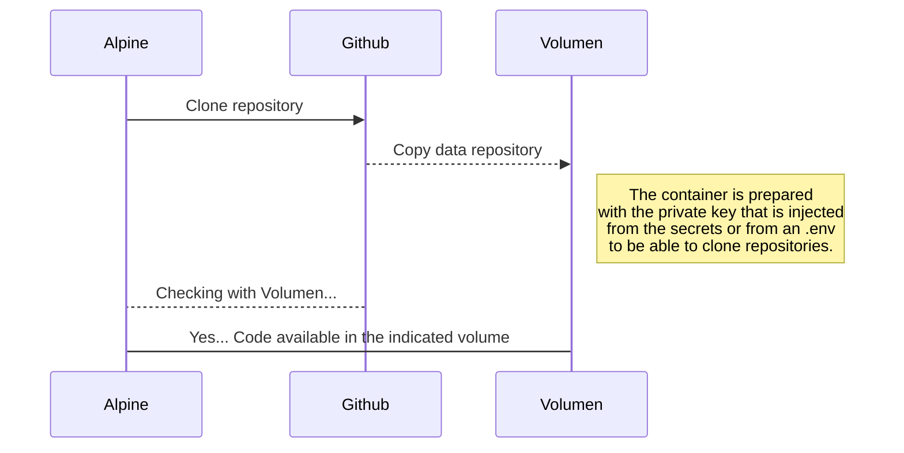
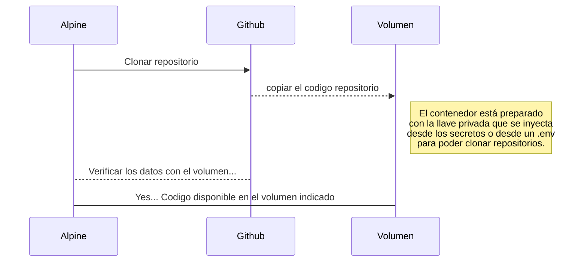

# Clone repository **(EN)** | Clonar Repositorio **(ES)**

### Container ready to clone git repositories **(EN)**
- Interesting proof of concept of how to make an orchestrator that allows you to clone your repositories inside a container and thus assign it to the volumes of the applications that are necessary **(EN)**

### Contenedor preparado para clonar repositorios git **(ES)**
- Prueba de concepto interesante de como hacer un orquestador que permita clonar tus repositorios dentro de un contenedor y así asignarlo a los volúmenes de los aplicativos que sean necesarios **(ES)**

### Sequence Diagram **(EN)**

### Diagrama de Secuencia **(ES)**

### Flow **(EN)**  
- Clone repository
- In line 11 and 12 of the **Dockerfile** replace with the user of the git cloud platform that you have
- Create key to be able to clone the repositories
> **Step 1.** Open the terminal app on your computer.
  **Step 2.** Enter the following command, substituting joe@domain.com with your email address: 
  **chris@server# ssh-keygen -t rsa -b 4096 -C "joe@domain.com"**
  **Step 3.** Press Enter to accept the default file location.
  **Step 4.** Enter a secure passphrase.
  **Step 5.** Press Enter.
  **Step 6.** Enter this command to display the contents of your public key: ** user@server# cat .ssh/id_rsa.pub **
  **Step 7.** Copy the contents of your key to your clipboard (we will need it later).
  **Step 8.** How to add an SSH key to your Git cloud account, Github example
  **Step 9.** Create a secret in git or in your cloud platform to add the id_rsa.pub key to the ID_RSA secret
- In line 19 of the **create-id-rsa.sh** replace with the repository of the git cloud platform that you have
- execute repository ** docker-compose up -d --build ** 

### Flujo **(ES)**
- Repositorio de clones
- En la línea 11 y 12 del **Dockerfile** reemplace con el usuario de la plataforma de nube git que tiene
- Crear clave para poder clonar los repositorios
> **Paso 1.** Abra la aplicación de terminal en su computadora.
  **Paso 2.** Ingresa el siguiente comando, reemplazando joe@domain.com con tu dirección de correo electrónico:
  **chris@servidor# ssh-keygen -t rsa -b 4096 -C "joe@dominio.com"**
  **Paso 3.** Presione Entrar para aceptar la ubicación predeterminada del archivo.
  **Paso 4.** Ingrese una frase de contraseña segura.
  **Paso 5.** Presiona Enter.
  **Paso 6.** Ingrese este comando para mostrar el contenido de su clave pública: ** usuario@servidor# cat .ssh/id_rsa.pub **
  **Paso 7.** Copie el contenido de su clave en su portapapeles (lo necesitaremos más adelante).
  **Paso 8.** Cómo agregar una clave SSH a su cuenta en la nube de Git, ejemplo de Github
  **Paso 9.** Cree un secreto en git o su plataforma en la nube para agregar la clave id_rsa.pub al secreto ID_RSA
- En la línea 19 de **create-id-rsa.sh**, reemplácelo con el repositorio de la plataforma en la nube de git que tiene
- ejecuta el repositorio ** docker-compose up -d --build **